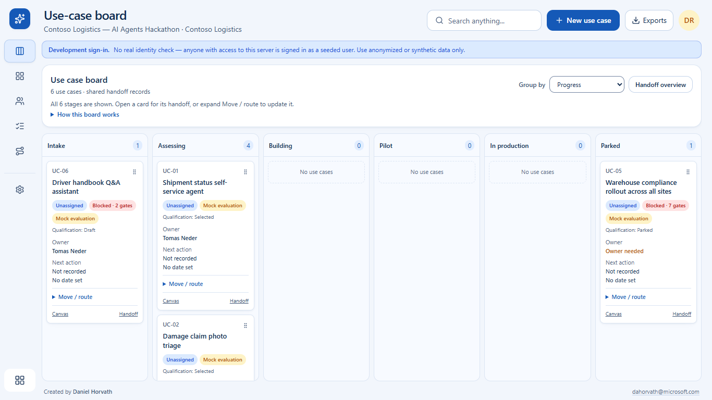

# Hackathon Facilitator

**Created by Daniel Horvath** · [dahorvath@microsoft.com](mailto:dahorvath@microsoft.com)

A blue, Kanban-first workspace for AI hackathon use cases: make progress visible,
keep delivery routes separate, and leave every prototype with an owner and a next
action. The full local app, optional Copilot agent and editable workshop materials
are now in one public repository.

**Experimental local MVP, not an official Microsoft product or production service.**

## Full application — one-click Windows setup

### **[Download Hackathon Facilitator for Windows](https://github.com/HorvathDaniel-2002/hackathon-facilitator-agent/releases/download/v0.3.2/Hackathon-Facilitator-Setup-0.3.2.exe)**

**This is the original full app, not the lightweight Browser Edition.**
Download the EXE and open it. Setup automatically selects **Intel/AMD x64 or
Windows ARM64**, installs for your Windows account and opens the application.
There is no setup wizard, architecture choice or separate Node.js/npm installation.
No Copilot subscription or Azure account is needed for the local mock-AI preview.

The full Kanban, use-case intake, mock evaluator/build guides, contacts, readiness,
handoffs, dashboard and exports are retained. Existing compatible desktop
workspaces stay in `%APPDATA%\Hackathon Facilitator\data`.
[Install, update and backup instructions](desktop/README.md).

**The EXE is still unsigned.** Windows or organizational policy may show a warning
or block it. One-click setup simplifies installation; it does not remove those
protections. Store signing remains a separate, pending route.



*Fictional sample workspace. Mock AI; statuses do not imply
approval, deployment or a CAF submission.*

## Choose how to try it

| I want to… | Start here | Required |
| --- | --- | --- |
| **Use the original full application** | **[One-click Windows installer](https://github.com/HorvathDaniel-2002/hackathon-facilitator-agent/releases/download/v0.3.2/Hackathon-Facilitator-Setup-0.3.2.exe)** | Windows x64/ARM64; no separate runtime or subscription |
| **Run the full app from source** | Download the [source ZIP](https://github.com/HorvathDaniel-2002/hackathon-facilitator-agent/releases/download/v0.3.2/hackathon-facilitator-0.3.2-source-r2.zip), extract it and run **Start-Hackathon.cmd** on Windows | [Node.js 24](https://nodejs.org/en/download), a browser and internet for first-run dependencies |
| **Try the optional, reduced browser companion** | [Browser Edition](https://horvathdaniel-2002.github.io/hackathon-facilitator-agent/) · [scope and backups](browser/README.md) | Browser-local data; not the full application and no desktop-data migration |
| **Use the materials without installing anything** | [Word playbook](https://github.com/HorvathDaniel-2002/hackathon-facilitator-agent/raw/refs/heads/main/materials/Hackathon-Facilitator-Playbook.docx), [PowerPoint workshop](https://github.com/HorvathDaniel-2002/hackathon-facilitator-agent/raw/refs/heads/main/materials/Hackathon-Facilitator-Workshop.pptx), or [PDFs](materials/README.md) | Word/PowerPoint-compatible app, or a PDF viewer |
| **Use the Copilot agent** | Open the extracted repository in VS Code, then select **hackathon-facilitator** in Copilot Chat | Permitted GitHub Copilot access |

The local demo and the materials **do not require a Copilot subscription or an
Azure API key**. Copilot access is needed only for the separate agent.

## End-to-end checked

**28 September 2026, v0.3.2:** the same universal installer passed native x64 and
ARM64 fresh-install and v0.3.1-upgrade scenarios, with no installer arguments or
wizard clicks, automatic launch, the full app workflow and saved-data preservation.

**25 September 2026:** 495 unit/API tests, 69 browser E2E tests and 40 desktop
policy/runtime tests passed. The Windows x64 and native ARM64 installers were
also installed, exercised, reinstalled and uninstalled on disposable runners,
with saved data retained.

[Full test report, CI evidence and explicit limitations](docs/end-to-end-validation.md)
· [Installer build and lifecycle checks](https://github.com/HorvathDaniel-2002/hackathon-facilitator-agent/actions/workflows/build-desktop.yml)

## Windows desktop preview

**Microsoft Store version: in preparation, not yet available.**
[MSIX onboarding, packaging and submission guide](desktop/store/README.md).
This route avoids buying a CA-trusted certificate for the Store submission;
Microsoft re-signs MSIX packages after certification. No Store account/product
identity has been supplied yet. The current EXE downloads remain unsigned.

The desktop installer includes its own runtime and opens a dedicated application
window. It adds a Start menu entry and desktop shortcut. Closing the
window keeps it in the notification area; use **Open** to restore or **Quit** to
exit fully. You can pin the running app to the taskbar yourself.

Data is stored separately in `%APPDATA%\Hackathon Facilitator\data` and is not
overwritten by reinstalling a compatible version.
[Desktop installation, tray behavior, backup and build guide](desktop/README.md).

**The initial Windows preview is unsigned.** SmartScreen or organizational policy
may block it. Do not disable those protections; ask IT to review/sign/approve it.
The desktop preview is a local single-user app with mock AI, not Entra SSO or a
corporate production deployment.

**Why Edge says “isn't commonly downloaded”:** the current installer is unsigned
and has limited download reputation. A protected trusted-signing workflow is now
prepared, but it cannot issue a trusted signature until an authorized publisher
and signing profile are supplied. The published files are **still unsigned**.
[Signing prerequisites and the administrator request](desktop/signing/README.md).
For an individual publisher, see the
[personal CA certificate route](desktop/signing/individual-signing.md); it does
not require an Azure tenant or Microsoft-internal signing access.
Do not disable SmartScreen or install a self-signed root to suppress this warning.

## Full local web app: developer setup

1. Install **Node.js 24**. Extract the ZIP into a normal writable folder.
2. **Windows:** double-click `Start-Hackathon.cmd` in the extracted root.
   **macOS/Linux:** open a terminal in the extracted folder and run:

   ```text
   node app/scripts/start-demo.mjs
   ```

3. Wait for dependencies and the fictional sample workspace to be prepared.
   The browser opens on the **Kanban board**. Keep the terminal open; **Ctrl+C**
   stops the app. Use the same launcher next time.

If you prefer npm, run `npm run demo` from the `app` folder.
[Detailed setup and troubleshooting](app/docs/local-demo-setup.md).

The launcher uses its own local synthetic-data database, mock AI and loopback-only
development sign-in. It does not reset another workspace, read your customer
database or configure any cloud service. Existing installations with older
schemas must use the [reviewed migration procedure](app/docs/kanban-workflow.md),
not an automatic reset.

## What changed

- **Responsive Kanban:** all progress columns fit across desktop screens;
  smaller screens use a responsive layout instead of a horizontally clipped board.
- **Kanban is home; Dashboard is optional.** Choose Dashboard in navigation for
  assessment charts and summaries.
- **Progress and delivery are independent:** Intake, Assessing, Building, Pilot,
  In production and Parked; group the same cards by Copilot / Cowork, Copilot
  Studio, Custom build, CAF or Unassigned.
- **One shared handoff:** open a card's side panel or the Handoff overview to
  edit owners, next action/date, results and evidence.
- **Evidence-backed records:** In production and Submitted to CAF require an owner
  and reference. Saving records something done elsewhere; it never deploys or
  submits to CAF.
- **Simpler navigation:** standalone Charter and Milestones have been removed.
  Workspace Settings retain names, membership and lifecycle controls.

## No-install materials

Use the Word workbook manually, lead a session with the PowerPoint speaker notes,
or read/print the PDFs. [Download guide](materials/README.md).
Save completed copies in your approved team location. The materials are reusable
templates, not automatic Office exports from the web app.

## Optional Copilot agent

The `.github/agents` profile works independently of the app. To add it to an
existing workspace with Node.js 24:

```powershell
node .\scripts\install-copilot-agent.mjs --target "C:\src\my-project"
```

The installer does not overwrite local customizations or install cloud services.
Use `/agent` in Copilot CLI, or the agent picker in VS Code.
[Agent installation guide](docs/copilot-agent-installation.md).

## Scope and sharing

Only reviewed source, fictional seed data, public references and reusable
materials are distributed. **No customer records, databases, credentials,
private screenshots or original local git history are included.**
Do not upload real data, completed plans or approval evidence to public issues,
commits or forks.

The demo uses synthetic identities, not Entra SSO; do not expose it on a network
or deploy it as a corporate service. Mock evaluation scores are fixtures, not
validated portfolio recommendations. Live-model quality, real corporate sign-in,
production operations and required approvals remain separate work.

Public availability is not Microsoft approval, program eligibility or an
open-source license grant. The [Microsoft hackathon submission](docs/official-hackathon-submission.md)
is still a draft, not a submitted/accepted entry.

[Report a problem using a synthetic example](https://github.com/HorvathDaniel-2002/hackathon-facilitator-agent/issues)
· [Copy-ready colleague message](docs/colleague-distribution.md)
· [Source and developer instructions](app/README.md)
